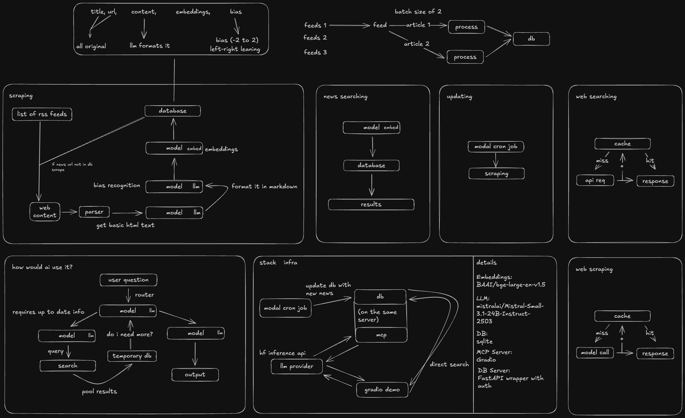

# uplink - real-time information for llms
uplink brings real-time information to llms, as if the llm were trained 5 minutes ago

uplink features:
- backend (sqlite3 server running at home, where a modal cron job sends the new news articles back, and google-searching has caching (because, why not?))
- mcp (for your every day llms)
- agent for using this stuff

## what does it use (+ why)?
- conversion llm: `mistralai/Mistral-Small-3.1-24B-Instruct-2503`
    - practically uncensored compared to other llms. llama models would throw a hissy fit about political topics, which is all news is now. also has a HUGE context window.
- embedding model: `BAAI/bge-large-en-v1.5`
    - honestly, I don't know, felt like it.
- DB: `sqlite3`
    - easiest thing to use, and never changed
- search: google's custom search api with rotating keys
    - i'm broke, i can't afford requests
- agent model: `mistral-medium-2505`
    - nice and cheap (i'm paying for it myself) - also, has amazing tool call capabilities

(notice how i'm using mostly mistral plz)
(this isnt a slop project)

## security?
pretty pathetic to be honest, but it's a hackathon. trying to keep everything hidden away.

## i might want to deploy it for myself

alright so:
- (read the env example first)
1. install the deps (`pip install -r requirements.txt`, or `uv pip install -r requirements.txt` depending on the type of person you are)
2. do an initial scrape (`initial_scrape.py`) -  this will take a while.
3. run `db_server.py`, and update your .env to accomodate for this
4. then you can deploy `modal_update.py` that updates all the time every 5 minutes, or `update_hard.py` for a local update (also every 5 minutes)
5. then, `main_server.py`, and `mcp/app.py`. (make sure `db_server.py` is still running though!)

## i want my own news sources!
`utils/mappings.py` - mappings

`utils/feeds.py` - rss feeds

(read it and you'll understand how it works)

## contributing?
if you really *really* want to, fork and pr. no need to do so.

## license?
[dbad-derivative](license)